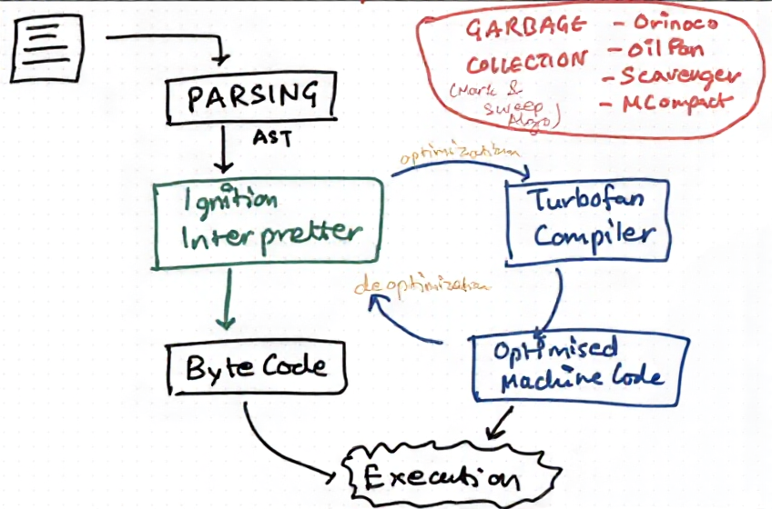

# How V8 works


### Parsing have two steps in it.
1. Lexical Analysis - where everthing in code break into key and token and checks for spelling errors.
2. Syntax Analysis - from the tokens it builds the AST (Abstract Syntax Tree) and checks for the syntactical errors.

### Working
- Parsed code is first converted to `byte code` by interpreter and then interpreter starts to execute it.
- When interpreter see and `HOT` code then it sends it to compiler to compile it so next time it can be run more fast and optimized.
- While compiling compiler takes some assumptions and if further that code has to be executed with not satisfying those assumptions than compiler deoptimize the code and sends to interpreter and run it.
- And if assumptions are satisfied then the optimized version will run very fastly.

### Semantic Analysis

- It is done before and after byte code generation and also in compiler.

- Before byte code generation basic semantics are check for semantic errors.
``` javascript
let a = 15;
let a = 16; ❌//duplicate variable (semantic error)
```

- After byte code generation dynamic semantics are check

``` javascript
function f(x) { return x + 1; }

f(10);     // number
f(20);     // number
f("hi");   // string  ← semantics change here
```

- In compilation deep semantic analysis and type analysis is done (like type semantics, object semantics, function semantics, etc.).

- This whole is called `JIT (Just-In-Time compilation)` which uses power of both interpreter and compiler.