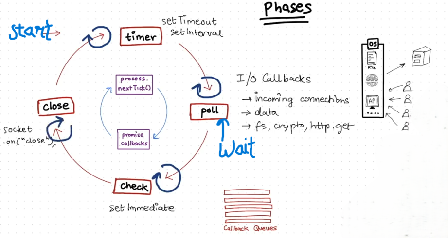

# Libuv
- Nodejs gives all js code to v8 engine to execute it and when v8 sees any asynchronous code it offloads it to libuv to wait for response or timer.
- When timer expires it or function get the response the function goes to callback queues.
- Event loop checks if the call stack is empty and if its empty then it takes one function from callback queue and push it to call stack in v8 to execute it further.

## Event Loop

- Inner loop is `Microtask Processing` and the outer one is real `Event loop`.

- Before starting of each phase in outer loop it first completes the inner loop (like before timer it runs inner and then timer and after timer it runs inner loop and then the poll phase and so on).

- For every phase in inner or outer loop they have separate callback queues.

- When callbacks gets empty the event loop runs the inner loop and waits on poll phase and when something comes in callback it first runs for poll.

- Unlike browsers event loop which runs repeatedly it waits on poll phase till something gets into callback queues.

## Thread Pool
- These are the software threads present in libuv to process the cpu heavy tasks.
- By default their size is 4 but it can be reset by `process.env.UV_THREADPOOL_SIZE = (NUMBER YOU WANT)`.
- Tasks run in run parallel on different threads.
- Processes which use threadpool are file system operation (fs.read, fs.write, etc.), cryptography (pbkdf2, script, random byte generation), compression (zlib operations), DNS lookups.

> - API calls do not use threadpool because if one client uses one thread for connection then there can be thousands or lakhs of clients at a time which can't be managed so nodejs uses sockets + event driven I/O. Event loop and sockets shares same single thread of OS not of threadpool. 
> - Threads of threadpool are allocated to threads of OS by one to one mapping. 
> - Also threadpool is only used by cpu heavy or blocking code while api calls are non blocking as when request is send till the system not responded event loop do not sit idle it can run and when system respond it then function is send to callback queue of poll phase of event loop.

- When libuv initiates a network call, the OS creates a single non-blocking `socket` identified by one `file descriptor (fd)`. The socket is registered with the `OS I/O multiplexer` (like epoll). When the server sends data, the kernel receives it as packets, reassembles them into a `TCP byte stream` and stores it in the socket’s receive buffer. The kernel then notifies libuv that the socket is readable, after which libuv schedules the corresponding callback in the poll phase callback queue of the event loop.
### <u>Socket :- </u> 
It is a software structure serve as the endpoint for sending or receiving data. It has complex data structure maintained by os. 

It has :-
#### 1. Connection Identifiers :- 
To ensure data reaches correct destination. Every socket has unique combination of 5 values. 
- Protocol :- for the methods of sending or receiving data.
- Local IP address & Port :- your computer's identity for this session.
- Remote IP address & Port :- identity of computer you are linking to.
#### 2. Operational Buffers :- 
Sockets include dedicated memory regions for temporary data.
- Recieve Buffers :- hold incoming data from the network until you program calls.
- Send Buffers :- Stores data you program sent until the network hardware physically transmit it.
#### 3. State Control Meta Data :-
For connection oriented protocols like TCP, socket tracks the session's health and progress.
- Connection State :- current status (like LISTEN, ESTABLISHED, CLOSED, etc.).
- Sequence Numbers :- used by TCP to put incomming packets back in order.
- Flow Control Info :- tracks the "Window Size" (how much the other side can handle) to prevent from overwhelming the receiver.
- Retransmission Timers :- trackes if the packet is lost and needs to be resent.
#### 4.Interface Links :-
The socket acts as the connection between hardware and your app.
- Protocol operations :- pointers to the specific code that handles TCP, UDP, or other protocols.
- Wait Queue :- A list of processes waiting for data to arrive or for space to become available in the send buffer.
### <u>File Descriptor :- </u>
- It is a non negative integer that OS uses to identify open files.
- Sockets are treated as the communication file between two end points that's why sockets is identified as fds (file descriptors).
### <u>I/O Multiplexer :- </u>
- It is a system mechanism that allows single process (or thread) to moniter and manage multiple i/o streams (file desciptors) simultaneously.
- It uses algorithms like epoll (in linux), kqueue (in macOS), IOCP (in windows), etc.
#### How Multiplexer Works:-
- OS calls the wait function. When no data is available, the kernel puts the process on sleep freeing up the space for other tasks.
- When evernt occurs such as network packet arriving, the network hardware triggers an interrupt. The kernel identify which FD is ready now and adds it to ready list.
- Then kernel wakes up the sleeping process and returns only the FDs which are ready to be processed.
>- Libuv takes the FD and registers it with OS I/O multiplexer.
>- In Poll phase event loop effectively calls multiplexer, and if there is no code to run or no timer has expired, the entire nodejs pauses inside the multiplexer (Nodejs event loop pauses in poll phase).
>- When a packet arrives at your network card and OS multiplexer sees that FD is now readable, the multiplexer wakes the event loop
>- Nodejs looks at its internal records and sees that FD is linked to specific js callback and that callback into the execution context to execute.
>- This whole concept is called the event driven architecture as everything is working on events like when packet arrives the "event" happens and os wakes the event loop.

### <u> TCP Byte Stream :- </u>
- It treats the data as continuous, ordered flow of 8 bytes of data rather than distict or separate messages.